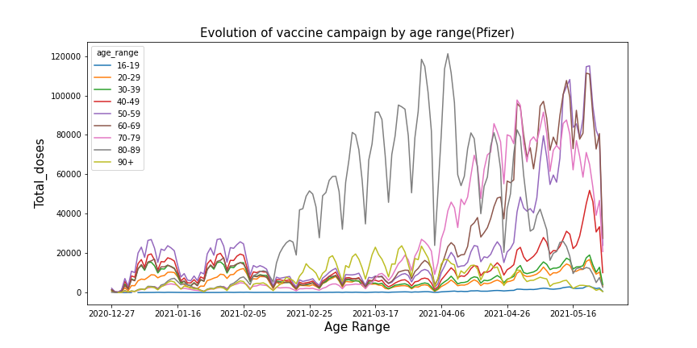
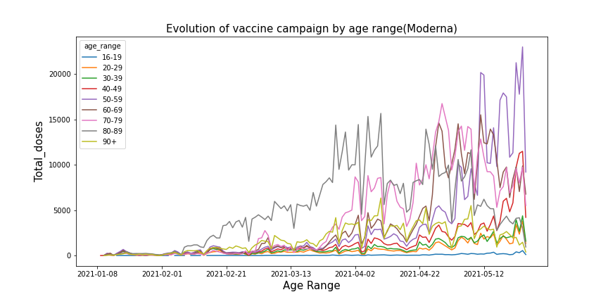

Italy Vaccination Campaign
================
Table of Content
================
  * [Description](#description)
  * [Installation guide](#installation-guide)
  * [Files](#files)
  * [Dataset](#dataset)
  * [Results](#results)
  * [Discussion](#discussion)
  * [Credits](#credits)
  * [Licensing](#licensing)

## Description
This is a project developed at the [CRI](https://cri-paris.org/en) Université de Paris in the second semester of the Master of Digital Science, within the [Challenge Hub](https://master.cri-paris.org/en/challenge-hub) program.
The project is an analysis of the vaccination campaign against covid-19 in Italy that began in 2020, it is using three different types of vaccines, which need two doses to be effective, also have different times between the first dose and the second, likewise, their availability and quantities are different.
The age groups are eight, the first is made up of young people between 16 and 19 years old, the following groups are for ten years up to 89 years and the last one is ninety years or more.

## Installation guide

If you use conda, you can install: 

   * conda install pandas
   * conda install seaborn
   * conda install numpy

If you use pip, you can install: 

   * pip install pandas
   * pip install seaborn
   * pip install numpy
    
## Files

For this project, one downloaded file was used in the direction given above, 

* Italian vaccine campaign Date (December 27, 2020 to may 25, 2021) 
* source: https://www.kaggle.com/arthurio/italian-vaccination

## Dataset

the file contains information by groups of vaccinated people grouped by date and company supplier of the vaccine, It does not have individual registers that allow for groupal analysis, for example combining gender and age.

shape (57618, 22)

* Administration date: date of the vaccine administration
* Vaccine supplier: Pfizer, Astrazeneca and Moderna
* Region: abbreviation of the Italian region
* Age range: age group
* Number of males: number of vaccinated males
* Number of females: number of vaccinated females
* Number of healthcare workers: number of vaccinated healthcare workers
* Number of non-healthcare workers: number of vaccinated non-healthcare workers
* Care home patients: number of vaccinated care home patients
* Number of 60-69 people: number of vaccinated people aged 60-69
* Number of 70-79 people: number of vaccinated people aged 70-79
* Number of over 80: number of vaccinated people aged 80+
* Armed forces: number of vaccinated military personnel
* School staff: number of the vaccinated school staff
* Vulnerable subjects: number of vaccinated vulnerable subjects
* Others: number of vaccinated people from other categories
* First dose: number of administered first vaccine doses
* Second dose: number of administered second vaccine doses
* NUTS1 code: European code for major socio-economic regions
* NUTS2 code: European code for basic regions for the application of regional policies
* ISTAT code: region code by Italian National Institute of Statistics
* Region name: full name of Italian regions

## Results
The presented graphs were divided into groups to be able to compare the performance of the vaccination campaign, the first group has the four types of vaccines, the second the comparison between the first and second doses, the third is the comparison between the male and female genders in the total doses applied by each supplier.

-  31,549,071 Total doses applied of the four vaccines between December 27, 2020 to may 25, 2021.

- the italian government started the vaccination campaign with Pfizer in December without major differences in age groups. In February, it prioritized the group from 80 to 89 years old with a clear difference. In the evaluated period and without making a difference between the first and second doses, the total of the pfizer vaccine reached a peak of 120,000 doses in one day.

- The Italian government started the AstraZeneca campaign with very few doses in January and in February, with greater availability, a prioritization of four groups of people between 20 and 29 years old, between 30 and 39 years old, between 40 and 49 years old, and finally between 50 and 59 years old, that happened until mid-March, then the group from 70 to 79 years old was prioritized until April, in that same month a policy change with this vaccine is seen since the vaccinated people are from the group from 60 to 69, ending the month of April and beginning May, people from other age groups are vaccinated again, in this case the four groups under 50 years of age.
In the evaluated period and without differentiating between the first and second doses, the total of the AstraZeneca vaccine reached a peak of about 80,000 doses in one day for the group aged 70 to 79 years.

- The government started Moderna AstraZeneca in January with few doses, since February they prioritized the group from 80 to 89 years old and in mid-March they also prioritized the group from 70 to 79 years old, also the group of people over 90 years old is included in the prioritization, in The same measure shows that the group from 60 to 69 has an increase between April and May, the performance in the month of May of the group between 50 and 59 years old with which the highest number of vaccines is achieved in an age group exceeds for this vaccine with about 20,000 doses in one day.

- The janssen vaccine is the one that takes the longest to be applied, it begins in the month of April with the group of 70 to 79 years, in the middle of that month the group of 60 to 69 years is included and ending the month of April it is includes the group from 50 to 59 years, the peak of vaccination by age group is the one from 60 to 69, reaching about 15,000 doses.
in mid-May, groups of under 50 years of age began to be vaccinated in smaller quantities.

- In these two graphs you can see the comparison between the two doses of the vaccines, in the case of pfizer the shortage is seen and therefore the decision is made between half of January and the first week of February not to apply more first due to a period in which the second dose is given priority, the case of AstraZeneca shows that it has a period of interruption in the month of March due to the doubts that arose with the vaccine and the application of second doses showing the difference in the times with Regarding the other vaccines, the third is the modern vaccine, this sample that in the second week of March they begin to have greater availability and their application increases both in the first dose and in the second dose at the same time, finally, the janssen vaccine has very small numbers compared to the other three vaccines..
  

- The graphics appear identical at first glance, but they present differences in some periods, For example, in December when the campaign begins, more women are vaccinated with Pfizer, This becomes evident again at the end of January and the beginning of February, where the difference is significant, with the other three vaccines the differences are very few, which indicates that gender differences have not been accounted for into account within the vaccination campaign.

- This is the distribution of the population to which the two doses of the vaccines of: pfizer, Astrazeneca and modern were applied, Janssen is not included due to its small number and only need a single dose, more than half of the population has at least 70 years, which reaffirms that the oldest population has been prioritizing.

## Discussion
- It remains to be analyzed if the vaccination had problems by region, if the youngest population group that includes minors should have been vaccinated in the first months and instead, the group over 90 years old should have been the priority or if the health personnel had to be vaccinated even faster. One point that is identified with all vaccines is that they have ups and downs in the number of vaccines applied, so determining which days the vaccination rate is lowered would be part of a new analysis.

## Credits
- The analysis of the dataset was carried out by Eliseo B.
- the file is in jupiternotebook format 
- "Italian-Campaign.pynb"

## Licensing
 MIT License, Eliseo Baquero 2021

